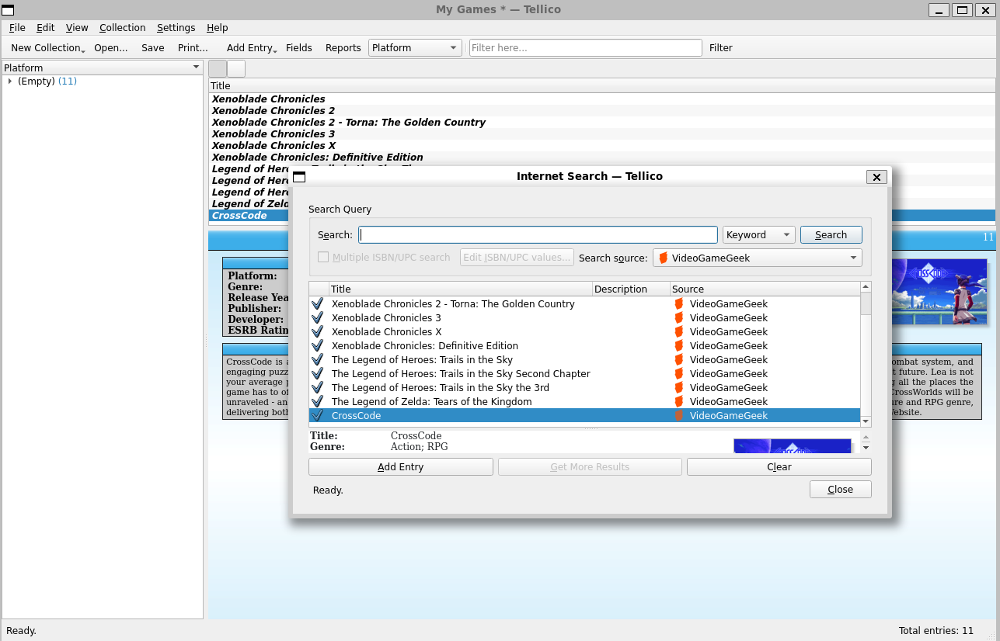

# Tellico - *Collection management software, free and simple*


*Screenshot of Tellico*

Copyright: 2001-2023 Robby Stephenson <robby@periapsis.org>

Author/Maintainer: Robby Stephenson <robby@periapsis.org>

# Table of Contents
1. [Description](#description)
2. [Features](#features)
3. [Installation](#installation)
4. [Usage](#usage)
5. [Contributing](#contributing)
6. [Known Issues](#knownissues)
7. [More Information](#moreinformation)
8. [License](#license)

## Description

Tellico makes it easy to track your books, videos, music, even your wine and
anything else. A simple and intuitive interface shows cover images, groupings,
and any detail you want. Grab information from many popular Internet sites,
including TheMovieDB, Discogs, IGDB, and many libraries.

Tellico is a part of the Office group of KDE Applications.

## Features
*Add new entries with data from the Internet:*



*Not happy with the default sources? Add your own!*


*Want to add your own thoughts? Edit each entry to your hearst content!*


## Installation

### Linux
Tellico is available from many Linux and *BSD distributions.
You can check your package manager to see if Tellico is available or review a [repository list](https://repology.org/project/tellico/versions) if you can't find it.

Specfically, you can easily install Tellico onto your Linux distribution by entering the following commands into your terminal:

```
sudo apt-get update
sudo apt-get install tellico
```
### Windows
As this project was built using the KDE libraries, it is not available natively on Windows. However, you can still try out Tellico by getting the Windows Subsystem for Linux (WSL) which is a virtual Linux distribution for Windows (the default distribution is Ubuntu). More information can be found here within Microsoft's documentation : [How to install Linux on Windows with WSL](https://learn.microsoft.com/en-us/windows/wsl/install)

Here is a brief guide on how to get Tellico on your Windows system:

**If you already had WSL installed you can skip to Step 4**

Step 1: Enter the following command into your Command Prompt or PowerShell as administrator:
```
wsl --install
```
(Optional): You can specify your desired distribution by using the ```-d``` flag, e.g.: ```wsl --install -d <Distribution Name>```, replace ```<Distribution Name>``` with the distribution you would like to install.

Step 2: During the installation you would be asked to enable Hyper-V (if not already enabled) and to restart your computer. 

Step 3: You would be asked to create your Linux user and password. After this step, you are ready to install Tellico.

Step 4: Open your installed Linux distribution and enter the following commands into the opened Command Prompt window: 
```
sudo apt-get update
sudo apt-get install tellico
```
You have now finished installing Tellico on Windows!

## Usage
### Windows
Simply enter ```Tellico``` into the Command Prompt and the Tellico windows will show up and you can start managing your collections.

### Linux
You can open Tellico by clicking on its icon in the desktop environment or enter ```Tellico``` into the Terminal .

There are plenty of tips and instructions within the program to help you get familiar with the Tellico interface.


## Contributing

### Linux
Type the following commands into the terminal:

Step 1: ```git clone https://github.com/KDE/tellico``` to clone this repo

Step 2: ```./configure``` to configure the package for your system.

Step 3: Look around the code and make your changes using your favorite code editor.

Step 4: ```make``` to compile the package with your changes.

Step 5: ```make install``` to install the program and test your changes.

### Windows
You can use the same commands listed in the Linux instruction in WSL to build and make changes to the program.

## Known Issues
Due to WSL limitations, programs running in WSL won't be able to connect to the Internet if a VPN is enabled, Tellico is no exception. This unfortunately breaks the Internet search feature. However, there are some workarounds provided here: [No internet connection while VPN is on.](https://superuser.com/questions/1630487/no-internet-connection-ubuntu-wsl-while-vpn)

## More Information

Visit the [Tellico homepage](https://tellico-project.org) or
[https://userbase.kde.org/Tellico]() for more information.
The [Tellico mailing list](mailto:tellico-users@kde.org) or
[Tellico forum](https://forum.kde.org/viewforum.php?f=200) can provide
further help. Please report bugs or make feature requests through the
[KDE bug reporting system](https://bugs.kde.org/buglist.cgi?query_format=specific&order=relevance+desc&bug_status=__all__&product=tellico).

## License
This project is under the GPL-2.0 license.
